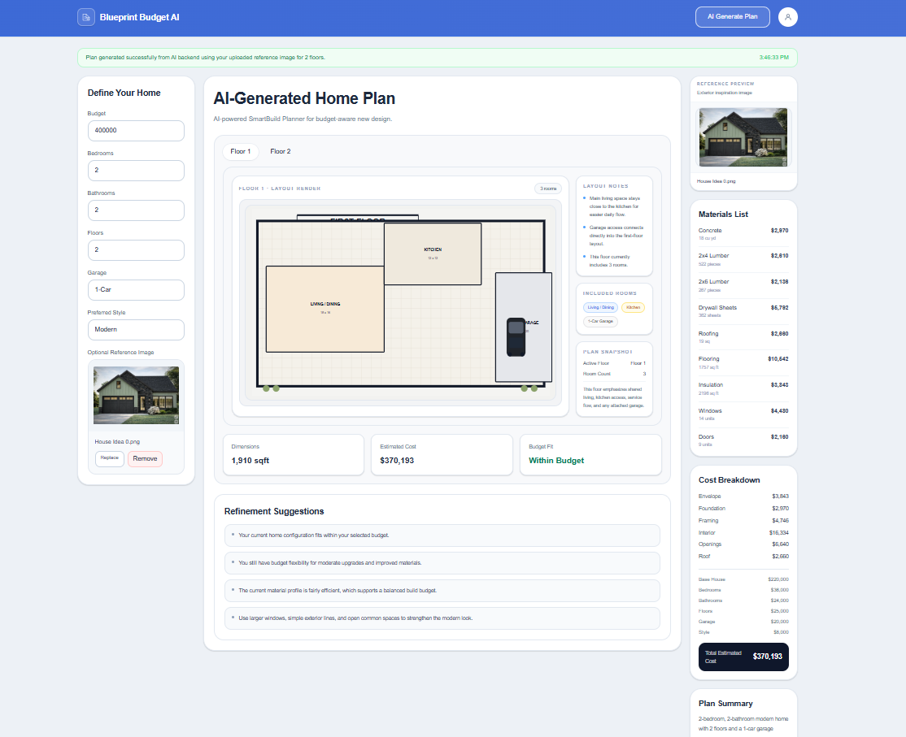
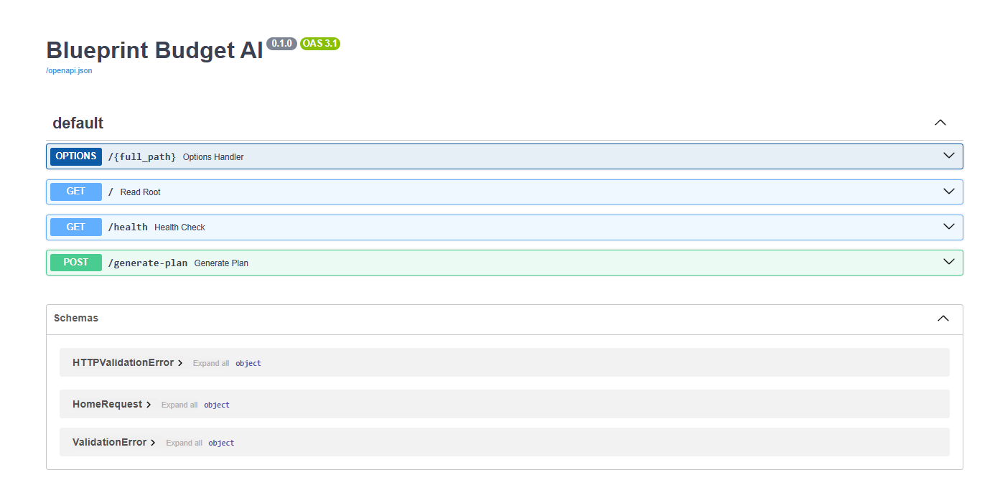
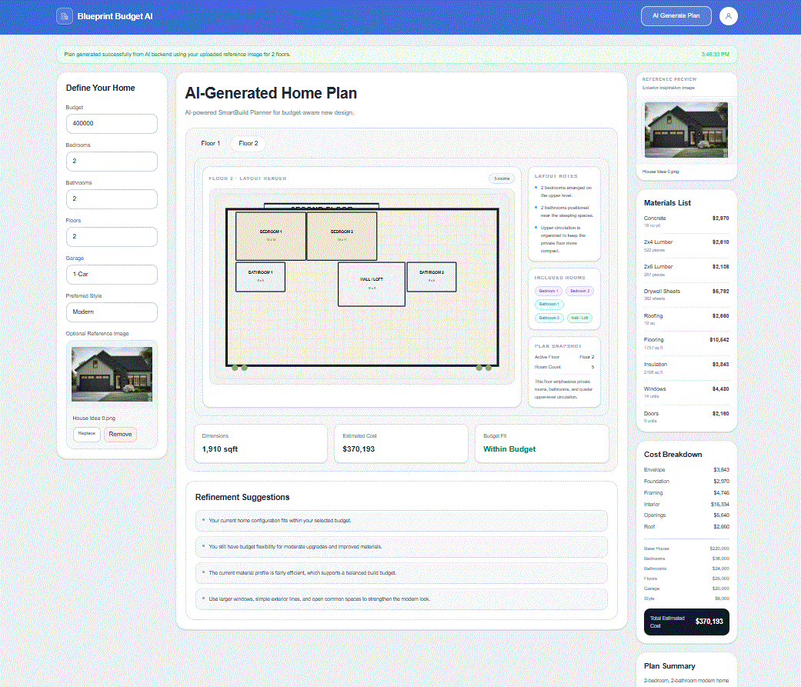
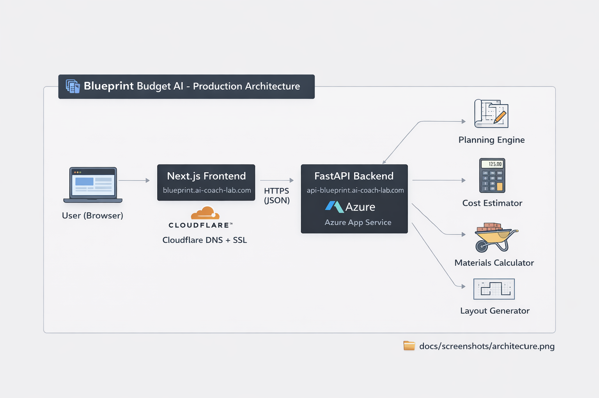

# 🏡 Blueprint Budget AI

<p align="center">
  
  
  
  
  
</p>

## 🚀 AI-Powered SmartBuild Planner

**Blueprint Budget AI is a full-stack AI-assisted home design platform that transforms user constraints (budget, layout, style) into structured floor plans, cost estimates, and material breakdowns — instantly.**

It bridges **design + cost intelligence**, helping users move from idea → actionable plan in seconds.

## 🌐 Live Links (Production)

- **UI (Vercel):** https://blueprint-budget-ai.vercel.app  
- **API (Railway):** https://your-railway-api-url.up.railway.app  
- **API Docs (Swagger):** https://your-railway-api-url.up.railway.app/docs  
- **Health Check:** https://your-railway-api-url.up.railway.app/health  

> ⚠️ Replace the Railway URL above once your backend is fully deployed.

## 🖼️ App Preview

### 🧠 AI-Generated Home Plan


### 📊 API Documentation (Swagger)


### 🎬 Demo Walkthrough


### 🏗️ Production Architecture


## ✅ What This App Does

Blueprint Budget AI enables:

- 🏡 **Budget-driven home planning**
- 🧠 **AI-generated floor layouts**
- 🏢 **Multi-floor design support**
- 💰 **Cost estimation + budget validation**
- 📦 **Material breakdown generation**
- 🖼️ **Reference image-guided design**
- ⚡ **Real-time frontend ↔ backend interaction**

## 💡 Why This Project Is Different

Most home design tools focus only on **visual layout**.

👉 Blueprint Budget AI combines:

- **Design + Cost Intelligence**
- **User constraints → structured outputs**
- **Real-time decision feedback (within budget / over budget)**

This makes it closer to a **decision-support system**, not just a design tool.

## ⚙️ Tech Stack

| Layer | Technology |
|------|-----------|
| Frontend | Next.js (App Router), TypeScript |
| Backend | FastAPI (Python) |
| Hosting (Frontend) | Vercel |
| Hosting (Backend) | Railway |
| API | REST (JSON over HTTPS) |

## 🧠 Architecture

### Production

- **Next.js UI:** Vercel
- **FastAPI API:** Railway
- **Communication:** HTTPS REST API

## 🔧 System Flow

```mermaid
flowchart LR
  U["User (Browser)"] --> UI["Next.js UI (Vercel)"]
  UI -->|HTTPS JSON| API["FastAPI API (Railway)"]

  API --> ENGINE["Planning Engine"]
  API --> COST["Cost Estimator"]
  API --> MATERIALS["Materials Calculator"]
  API --> LAYOUT["Layout Generator"]
